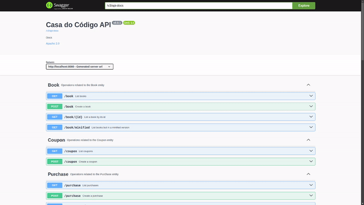
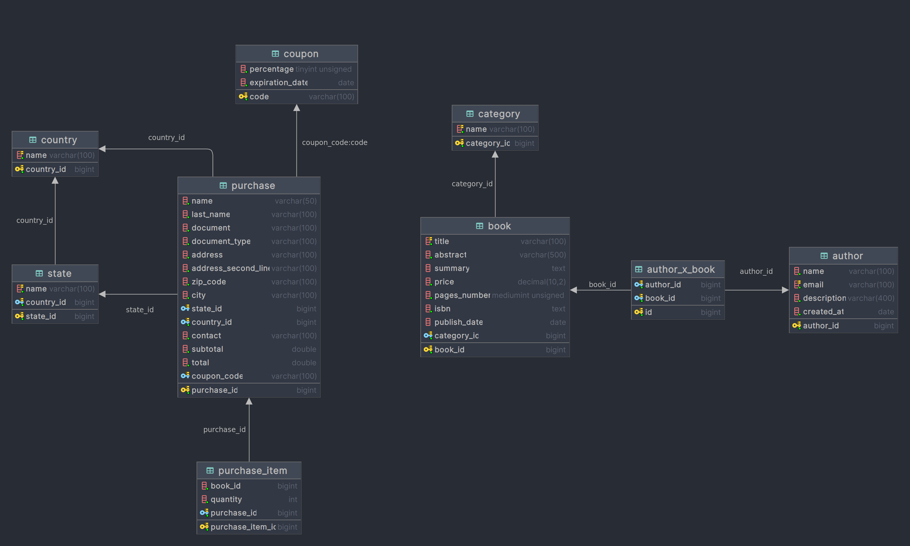

# Dev Eficiente Challenge
<p align="center">


</p>
  
<p align="center">
  
</p> 
  
## Running
### Linux
Open the terminal in the repository root folder, and then execute the following command:
```shell
./mvnw spring-boot:run
```
PS.: if you face permission issues, just run the command bellow, and then run the command above after again.
```shell
chmod +x mvnw
```
### Windows
Open the terminal in the repository root folder, and then execute the following command:
```shell
.\mvnw.cmd spring-boot:run
```
PS.: if you face permission issues, just run the terminal as administrator and you'll be good to go. 😃  
Once the application is running, you can access the Swagger documentation by navigating to http://localhost:8080. 
## Project Overview
This project is a challenge proposed by Alberto Souza as part of the Dev Eficiente course. The objective is to create a 
system (specifically, an API) that simulates the functionality of the Casa do Código website, which is an online bookstore.  
The system allows for the management of entities such as authors, books, and purchases, following a structured backend architecture.
## Stack  
 - Language: Java v21;
 - Framework: Spring & Spring Boot;
 - Docs: Swagger/OpenAPI;
 - Database: MySQL (RDBMS).
## Entities  
 - **Author**: Represents the book authors;
 - **Book**: Represents the books available in the store;
 - **Category**: Represents different book categories;
 - **Country**: Represents the countries for user addresses;
 - **State**: Represents states within a country;
 - **Coupon**: Discount coupons applicable to purchases;
 - **Purchase**: Represents customer purchases, including payment details;
 - **PurchaseItem**: Represents individual items within a purchase, linking a specific book to the purchase and 
capturing its quantity.
## DB Diagram  
<p align="center">
  
</p> 
